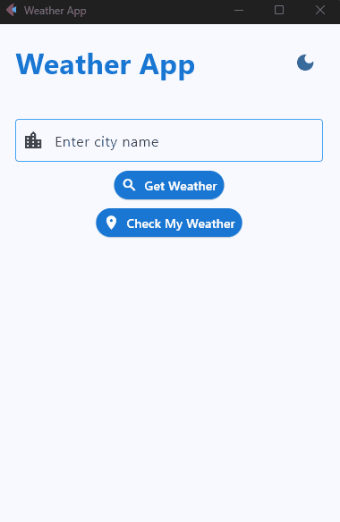
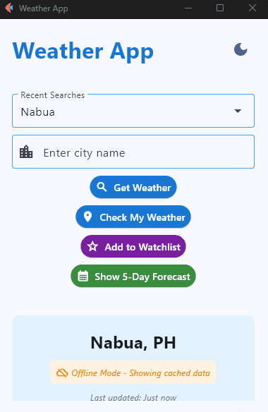
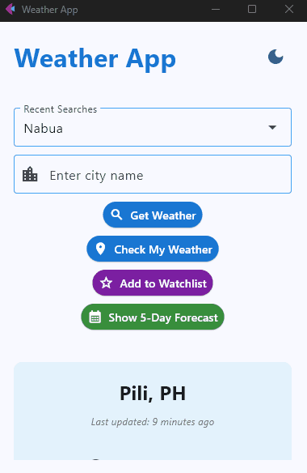
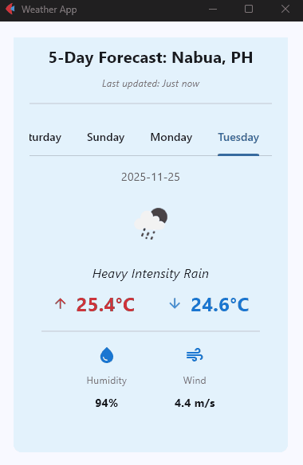
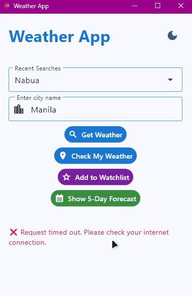
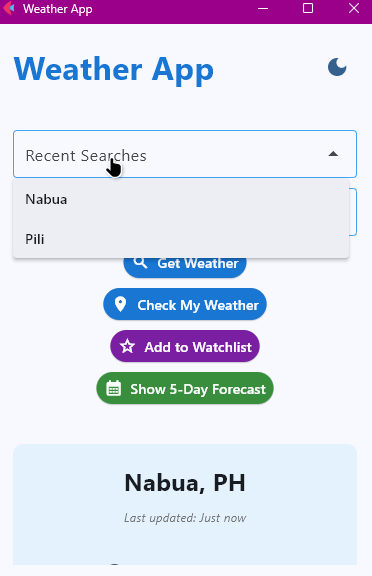
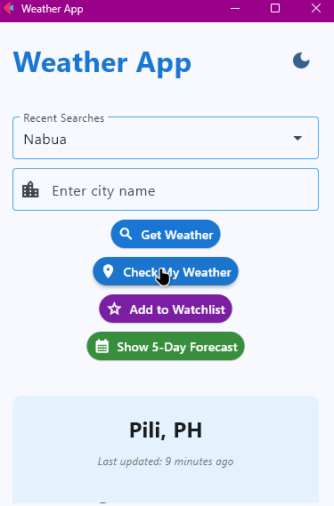
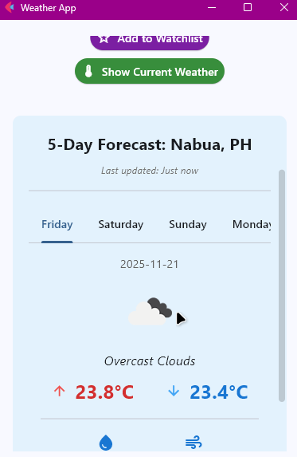
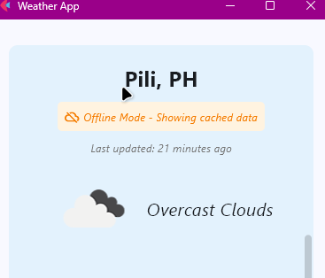
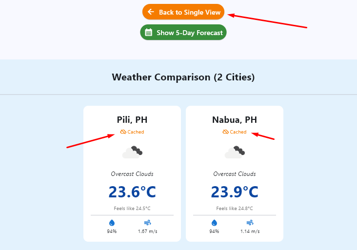

# Weather Application - Module 6 Lab

## Student Information
- **Name**: Jave Atanacio Bacsain
- **Student ID**: 231003016
- **Course**: CCCS 106
- **Section**: BSCS-3A

## Project Overview
This weather application is built with Python and the Flet framework. It provides real-time weather information for cities worldwide through the OpenWeatherMap API. The application displays current temperature, humidity levels, wind speed, and weather conditions in a clean, intuitive interface that follows Material Design principles. Users can search for any city by name or use their current location to get instant weather updates. The app also maintains a searchable history of previously viewed locations for quick access.

## Features Implemented

### Base Features
- [x] City search functionality
- [x] Current weather display
- [x] Temperature, humidity, wind speed
- [x] Weather icons
- [x] Error handling
- [x] Modern UI with Material Design

### Enhanced Features
1. **Search History with Persistent Storage**

   
   
   ##### *Dropdown menu showing search history and quick city selection*

   - **Description**: The app automatically saves the last 10 cities you've searched in a JSON file called `search_history.json`. These show up in a dropdown menu, so you can click on any city you've searched before and get its weather instantly without needing to type it again. The history sticks around even after you close the app, and it updates in real-time as you search for new places.
   
   - **Why I chose this feature**: Typing the same cities over and over gets old fast. This just made sense for everyday use. Plus, I needed practice with file I/O and state management anyway.
   
   - **Implementation Details**:
     - Saved search history to a JSON file (like a text file that stores data in a structured way)
     - Created a dropdown menu that automatically fills with your past searches
     - Made sure the same city doesn't appear twice in the list
     - Most recent searches show up at the top
     - Kept only the last 10 searches to avoid clutter
     - Dropdown updates right away after each search
     - Added a smooth fade-in animation when the dropdown appears
     - Dropdown only shows up when you actually have search history
   
   - **Challenges and Solutions**: 
     - *Challenge*: **Loading Data Too Late**. I tried to create the dropdown before loading the saved history, which caused errors.
     - *Solution*: Made sure to load the history data first, then build the dropdown afterwards.
     
     - *Challenge*: **Connecting Dropdown to Search**. Didn't know how to make clicking a city in the dropdown actually search for it.
     - *Solution*: Created a function that grabs the selected city, puts it in the search box, and starts the search automatically.
     
     - *Challenge*: **Dropdown Not Updating**. After searching a new city, it wouldn't show up in the dropdown until I restarted the app.
     - *Solution*: After adding a city to history, I manually rebuilt the dropdown list and told the app to refresh the screen.
     
     - *Challenge*: **Function Expected Input It Didn't Always Get**. My search function expected to receive data when clicked, but sometimes I called it without that data.
     - *Solution*: Made the function work both ways by making that input optional.
     
     - *Challenge*: **Wrong Data Format for Dropdown**. Tried giving the dropdown simple city names, but it needed them wrapped in a special format.
     - *Solution*: Wrapped each city name in the proper format the dropdown expected.

2. **Current Location Weather with IP Geolocation**

   
   
   ##### *One-click location detection showing local weather instantly*

   - **Description**: The app can automatically detect your location and show you the weather where you are right now. When you click the "Check My Weather" button, it uses your IP address to figure out your coordinates, then fetches the weather for that exact spot. No typing needed. Just one click and you get your local weather instantly. It works through the ipgeolocation.io API, which takes your IP and returns latitude and longitude coordinates. The app then passes those coordinates to OpenWeather's API to get the actual weather data.

   - **Why I chose this feature**: Sometimes you just want to know the weather where you are without typing anything. Most weather apps do this, so it felt natural. Plus, I was curious about how geolocation works and how APIs talk to each other.

   - **Implementation Details**:
     - Used ipgeolocation.io API to detect location from IP address
     - Added settings for the geolocation API key
     - Created a function that fetches weather using latitude and longitude instead of city name
     - Built a function that gets your coordinates first, then fetches the weather for that location
     - Added a "Check My Weather" button with a location icon
     - Used the same loading circle and error messages as the city search
     - Reused the same weather display function to avoid writing duplicate code

   - **Challenges and Solutions**:
     - *Challenge*: **Wrong API Address**. Got only my IP address back, not my location.
     - *Solution*: Was using the wrong web address. Switched to the correct one and got latitude and longitude.

     - *Challenge*: **API Key Not Being Sent**. API rejected my requests even though I had a key set up.
     - *Solution*: The variable name in my code didn't match the name in my settings file. Fixed by making them match.

     - *Challenge*: **Data Buried in Response**. Tried to grab coordinates directly but got an error. They were nested deeper in the response.
     - *Solution*: Updated my code to dig into the response structure properly. Used print statements to see what the data looked like.

     - *Challenge*: **Button Click Caused Weird Error**. Button crashed the app with a confusing error message about async functions.
     - *Solution*: Was calling the function immediately instead of waiting for the button click. Fixed by wrapping it properly so it only runs when clicked.

3. **5-Day Weather Forecast with Tabbed Interface**

   
   
   ##### *Switching to forecast view and navigating through daily tabs*

   

   ##### *Show current weather button (return)*

   - **Description**: The app now shows a 5-day weather forecast for any city you search. After you look up a city's current weather, a green "Show 5-Day Forecast" button appears. Click it, and you get tabs for each day of the week. Each tab displays that day's high and low temperatures (color-coded red for highs, blue for lows), the weather condition, an icon, and averages for humidity and wind speed. The forecast data comes from OpenWeather's forecast API, which returns weather predictions in 3-hour intervals. The app groups these intervals by day, calculates the min/max temperatures, and picks the most common weather condition to represent each day. You can switch back to the current weather view anytime by clicking "Show Current Weather."

   - **Why I chose this feature**: Showing just the current weather felt incomplete. If you're planning your week, you need to see what's coming. Plus, I wanted to learn how to work with tabbed interfaces and process more complex API data.

   - **Implementation Details**:
     - Created a function that requests 5-day forecast from OpenWeather API
     - API returns 40 data points (one every 3 hours), so I had to organize them
     - Created a function that processes the forecast data:
       - Loops through all 40 entries
       - Groups them by date
       - Collects temperatures, weather conditions, icons, humidity, and wind speed
       - Finds the highest and lowest temperature for each day
       - Picks the most common weather condition to represent the day
       - Gives back a clean list of 5 days
     - Built a function to display the forecast:
       - Creates a tab for each day
       - Each tab shows the date, weather icon, condition, high/low temps, humidity, and wind speed
       - Set a fixed height for the tabs (400 pixels)
       - Added fade-in animation like the weather display
     - Added a button to switch between current weather and forecast
     - Made the page scrollable to fit all the forecast content
     - Added smooth fade effects when switching views

   - **Challenges and Solutions**:
     - *Challenge*: **Too Much Data**. Got 40 entries back and didn't know how to turn it into 5 simple days.
     - *Solution*: Figured out each entry was a 3-hour time slot. Grouped all entries by date, found high/low temps for each day, and picked the most common weather condition.

     - *Challenge*: **Organizing Data by Day**. Tried using a simple list but couldn't easily check if I already had data for a day.
     - *Solution*: Switched to using a dictionary where each date was a key. Much easier to check if a day existed and add data to it.

     - *Challenge*: **Multiple Weather Conditions Per Day**. Each day had different conditions throughout. Needed to pick just one.
     - *Solution*: Counted which condition appeared most often and used that one.

     - *Challenge*: **Tabs Showed Blank Screen**. Built the forecast with tabs, but nothing appeared. Just empty space.
     - *Solution*: My tab settings were wrong. Changed to a fixed height and the tabs showed up.

     - *Challenge*: **Nothing Showed When Switching Back to Weather**. Toggling from forecast back to weather left a blank screen.
     - *Solution*: The weather was invisible because the fade effect left it transparent. Had to manually reset the transparency.

     - *Challenge*: **Forecast Button Missing for Geolocation**. Button appeared for city search but not when using "Check My Weather."
     - *Solution*: Forgot to add the button code to the geolocation function. Copied it over and both worked.

     - *Challenge*: **Old Weather Visible Behind Loading Circle**. Loading circle appeared on top of old weather data, looked messy.
     - *Solution*: Added fade-out effect to hide old data before showing the loading circle.

4. **Weather Data Caching and Offline Mode**

   

   ##### *Offline mode showing cached data with timestamp indicators*

   - **Description**: The app now saves weather data to your computer so you can still see the last result even when your internet cuts out. Every time you search for a city's weather or check the forecast, the app stores that information in a cache folder as JSON files. Each file includes a timestamp showing when the data was saved. If your internet connection drops or the API fails to respond, the app automatically pulls up the cached version instead of showing an error. You'll see an orange banner at the top that says "Offline Mode - Showing cached data" along with a message telling you when that data was last updated, like "5 minutes ago" or "2 hours ago." The cache expires after 30 minutes by default, but if you're offline, the app will still serve expired cache rather than leave you with nothing. It works for both current weather and the 5-day forecast, so you're covered either way.

   - **Why I chose this feature**: Error messages every time my internet hiccuped felt wasteful. The app already fetched the data once, why throw it away? Real apps remember what you looked at. Plus, I'd heard about caching but never built it myself. Good chance to learn timestamps and error handling.

   - **Implementation Details**:
     - Created a new file called `cache.py` with a class that handles all the caching
     - Cache saves data as files in a `cache/` folder with names like `london.json` and `london_forecast.json`
     - Each file contains the time it was saved and the actual weather data
     - Set cache to expire after 30 minutes, but made it adjustable
     - Modified the weather service to use caching:
       - Created a cache manager when the app starts
       - Added a flag to track if we're using old cached data or fresh data
       - Before calling the API, check if we already have recent data saved
       - If API call works, save the new data and mark that we're online
       - If API call fails (no internet), use the saved data instead of showing an error
       - Did the same thing for the 5-day forecast
       - For geolocation, used coordinates as the filename since there's no city name yet
     - Updated the main app to show cache information:
       - Created a function that converts timestamps to readable text like "5 minutes ago"
       - Modified weather and forecast displays to check if we're offline
       - Built the display elements in a list so I could add the offline banner when needed
       - Offline banner is orange with a cloud icon and clear message
       - Shows when the data was last updated in gray text
       - Kept all the fade animations working smoothly
     - Added error handling for broken cache files:
       - If a cache file is corrupted, delete it and start fresh
       - If saving to cache fails, just continue without caching instead of crashing

   - **Challenges and Solutions**:
     - *Challenge*: **No City Name for Geolocation**. Geolocation uses coordinates instead of city names. Didn't know what to name the cache file.
     - *Solution*: Used the coordinates as the filename like `coords_14.5995_120.9842`. Also grabbed the city name from the weather response and saved it for later. Not perfect but works.

     - *Challenge*: **When to Use Old Data**. At first, only used cache if less than 30 minutes old. But that meant showing errors when offline with slightly old data.
     - *Solution*: When online, always get fresh data. When offline, show any cached data even if it's old, but tell the user how old it is.

     - *Challenge*: **Mixing Up Weather and Forecast Cache**. Tried using the same functions for both, but kept getting confused about which data was which.
     - *Solution*: Made separate functions for forecast caching. Save forecast with `_forecast.json` at the end of filename so they're separate.

     - *Challenge*: **Couldn't Add Offline Banner Easily**. Weather display was already built. Hard to add conditional elements in the middle.
     - *Solution*: Changed approach to build display as a list first. Add location, check if offline to add banner, check timestamp to add it, then add rest of weather info. Build the column from that list.

     - *Challenge*: **Converting Timestamps to Readable Text**. Cache saves time as big numbers. Needed to show "5 minutes ago" instead.
     - *Solution*: Made a function that converts the number to a date, gets current time, calculates difference. If less than a minute say "Just now," if less than an hour show minutes, if less than a day show hours, otherwise show full date.

     - *Challenge*: **Cache Wouldn't Save Sometimes**. The `cache/` folder didn't exist yet and Python couldn't create files in a nonexistent folder.
     - *Solution*: Added code to create the folder when the app starts. Also wrapped save attempts in error handling so app keeps running even if save fails.

     - *Challenge*: **Offline Banner Stayed After Going Online**. Banner kept showing even with fresh data because I forgot to turn it off.
     - *Solution*: After every successful internet request, set the offline flag back to false.

5. **Multiple Cities Comparison with Watchlist**

   

   ##### *Adding cities to watchlist and comparing weather side-by-side*

   - **Description**: The app now lets you save multiple cities to a watchlist and compare their weather side by side. After you search for a city, a purple "Add to Watchlist" button appears. Click it, and that city gets saved to your watchlist. Once you have at least two cities saved, an orange "Compare Cities" button shows up. Click it, and you get a grid showing weather cards for all your saved cities at once. Each card displays the city name, current temperature, weather condition with an icon, feels-like temperature, humidity, and wind speed. The cards are arranged in rows of three, so you can see everything at a glance. You can switch back to single-city view anytime, and your watchlist persists between sessions. It's saved in a JSON file just like the search history, so your cities stay in the list even after you close the app. The comparison view automatically uses cached data when available, so if you recently searched for those cities, the comparison loads almost instantly without making new API calls.

   - **Why I chose this feature**: I don't just check one place. I check where I am, where my family lives, where I'm visiting. Searching each city one by one gets tedious. Watchlist lets you organize what matters, comparison gives you a quick overview. The caching feature made this even better since most cities load instantly from cache instead of waiting for API calls. Plus, I wanted to learn grid layouts and handling multiple async calls.

   - **Implementation Details**:
     - Created a new file called `watchlist.py` to handle saving and managing favorite cities
     - Watchlist saves city names to a file called `watchlist.json` like the search history
     - Made functions for adding, removing, loading, saving, and clearing cities
     - Added a function to count how many cities are saved
     - Modified the main app to use the watchlist:
       - Created a watchlist manager when app starts
       - Made a function that adds or removes the current city when you click the button
       - Made a function that shows the comparison button only when you have 2 or more cities saved
       - Made a function to switch between single city view and comparison view
       - Made a helper function to go back to single city view smoothly
     - Created a purple watchlist button that shows an empty star or filled star depending on if the city is saved
     - Created an orange comparison button that says "Compare 3 Cities" and only shows when you have at least 2 cities
     - Built a function to display the comparison view:
       - Fetches weather for all saved cities
       - If a city fails, just skip it instead of crashing
       - Creates smaller weather cards for each city
       - Arranges cards in rows of 3
       - Shows offline indicators if using cached data
       - Uses the same fade-in animation as other views
       - Checks if each city is using cached data and shows when it was last updated
       - Loads fast because most cities are already cached
     - Added the watchlist button to both city search and geolocation weather displays
     - Button automatically updates to show if current city is already in watchlist
     - Added a flag to track which view is active
     - Made comparison view scrollable for many cities
     - Shows title with count like "Weather Comparison (5 Cities)"

   - **Challenges and Solutions**:
     - *Challenge*: **Fetching Multiple Cities at Once**. Needed weather for multiple cities. Wasn't sure if I should get them one by one or all at once.
     - *Solution*: Kept it simple with a regular loop. Works fine for a few cities. If one city fails, just skip it and continue.

     - *Challenge*: **Button Showing Wrong State**. Watchlist button sometimes showed wrong text or icon.
     - *Solution*: Made a dedicated function to update the button. After showing weather, check if current city is in watchlist and update button to match.

     - *Challenge*: **Arranging Cards in Rows of 3**. Didn't know how to split the list of cards into groups of 3 for each row.
     - *Solution*: Used a loop that jumps by 3 each time, then grabbed 3 cards at a time from the list.

     - *Challenge*: **Managing Three Different Views**. Had current weather, forecast, and comparison views. Switching between them got confusing.
     - *Solution*: Added flags to track which view is active. Made a helper function that checks the flags and shows the right view.

     - *Challenge*: **Saved Cities Disappeared**. Cities I added to watchlist were gone after closing the app.
     - *Solution*: Forgot to actually save to the file after adding or removing cities. Added save calls and cities persisted.

     - *Challenge*: **Comparison Button Always Showing**. Button said "Compare 0 Cities" even when empty. Looked bad.
     - *Solution*: Made button only visible when you have at least 2 cities saved.

     - *Challenge*: **Cards Too Big**. Weather cards needed to be smaller for comparison view. Shrinking the regular design looked bad.
     - *Solution*: Redesigned cards from scratch with smaller text sizes, smaller icon, simpler layout, and fixed width.

     - *Challenge*: **Comparison Would Be Slow**. Fetching 5-6 cities from the internet every time would take a while.
     - *Solution*: Caching feature automatically handled it. Most cities load instantly from saved files instead of making internet requests.


## Screenshots

### Search History Feature

*Search history dropdown menu with recent city searches*

### Current Location Weather

*Automatic location detection showing local weather*

### 5-Day Forecast

*Tabbed interface displaying 5-day weather forecast*

### Caching & Offline Mode

*Offline mode displaying cached weather data with timestamps*

### Watchlist Comparison with Cached Data

*Multiple cities comparison view using cached data for faster loading*

## Installation

### Prerequisites
- Python 3.8 or higher
- pip package manager

### Setup Instructions
```bash
# Clone the repository
git clone https://github.com/<username>/cccs106-projects.git
cd cccs106-projects/mod6_labs

# Create virtual environment
python -m venv venv
source venv/bin/activate  # On Windows: venv\Scripts\activate

# Install dependencies
pip install -r requirements.txt

# Create .env file
cp .env.example .env
# Add your OpenWeatherMap API key to .env
```
