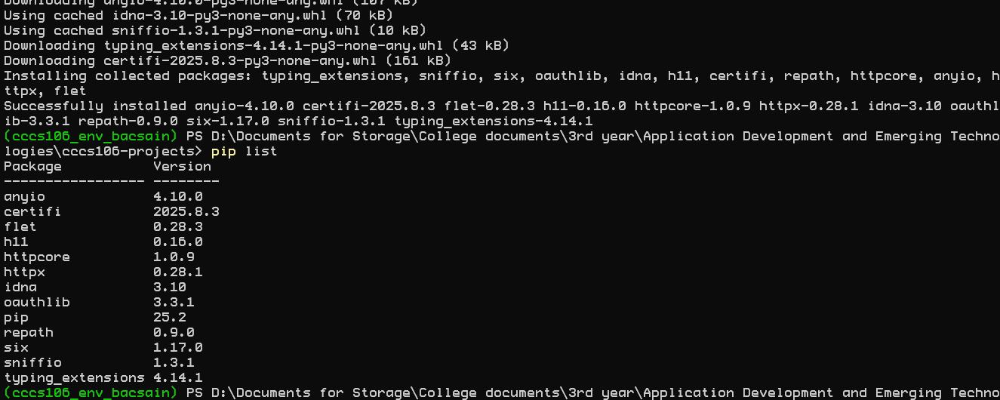
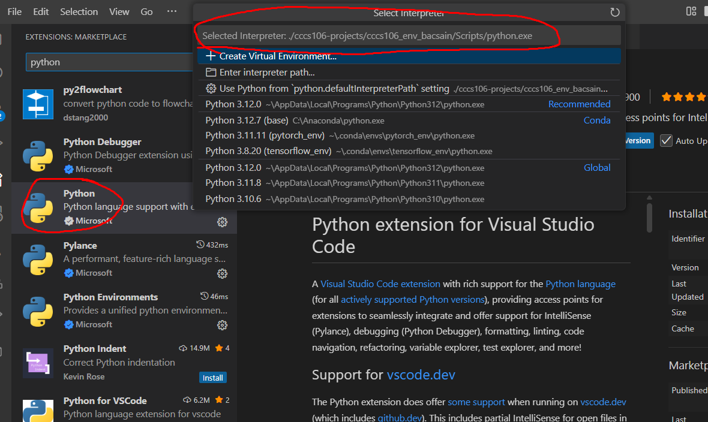
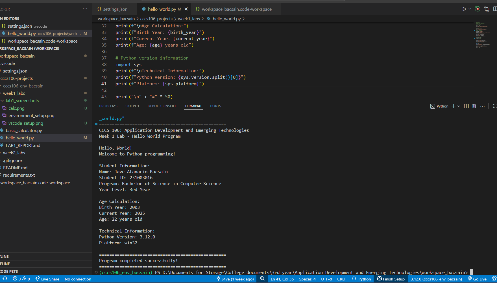
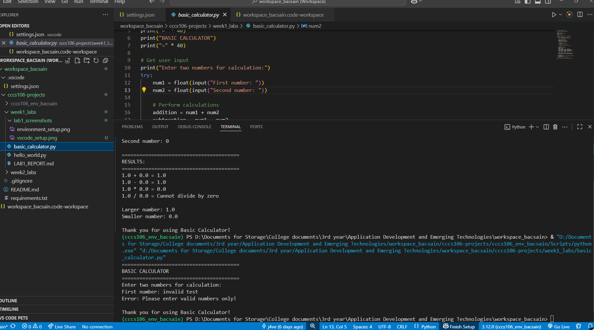

Create LAB1_REPORT.md:

# Lab 1 Report: Environment Setup and Python Basics

**Student Name:** Jave Atanacio Bacsain
**Student ID:** 231003016
**Section:** BSCS-3A
**Date:** September 2, 2025

## Environment Setup

### Python Installation
- **Python Version:** [3.12.0]
- **Installation Issues:** Workspace setup required specifying python `defaultInterpreterPath` in `settings.json` and corruption of virtual environment installation due to the moving of file directories.
- **Virtual Environment Created:** ✅ cccs106_env_bacsain

### VS Code Configuration
- **VS Code Version:** [e.g., 1.82.0]
- **Python Extension:** ✅ Installed and configured
- **Interpreter:** ✅ Set to `.\\cccs106-projects\\cccs106_env_bacsain\\Scripts\\python.exe` as the one in the instructions doesn't work in this case (Adjusted for specific workspace directory which is outside the main cccs106-projects folder)

### Package Installation
- **Flet Version:** 0.28.3
- **Other Packages:**  ```anyio==4.10.0``` ```certifi==2025.8.3``` ```h11==0.16.0``` ```httpcore==1.0.9``` ```httpx==0.28.1``` ```idna==3.10``` ```oauthlib==3.3.1``` ```repath==0.9.0``` ```six==1.17.0``` ```sniffio==1.3.1``` ```typing_extensions==4.15.0```

## Programs Created

### 1. hello_world.py
- **Status:** ✅ Completed
- **Features:** Student info display, age calculation, system info
- **Notes:** Just added my personal information, works as instructed

### 2. basic_calculator.py
- **Status:** ✅ Completed
- **Features:** Basic arithmetic, error handling, min/max calculation
- **Notes:** Nothing added, works as instructed

## Challenges and Solutions

Encountered issues setting up the workspace, including needing to specify `python.defaultInterpreterPath` in `settings.json`, dealing with a corrupted virtual environment caused by moving project directories, and additional difficulties configuring the workspace.

## Learning Outcomes

Learned how to use the `pip freeze` command to manage packages, gained experience configuring and using the workspace effectively, and practiced troubleshooting common issues in Python development environments, also tried to integrate `git` commands to put into a repository for future access.

## Screenshots

- **Environment Setup:**  
  

- **VS Code Configuration:**  
  

- **hello_world.py Output:**  
  

- **basic_calculator.py Output:**  
  