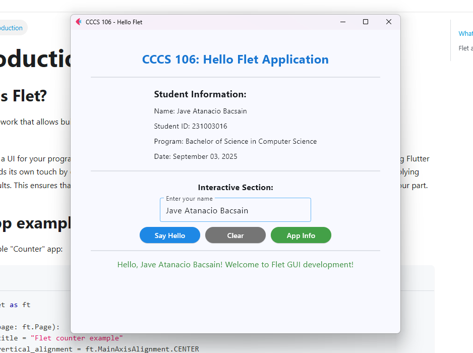
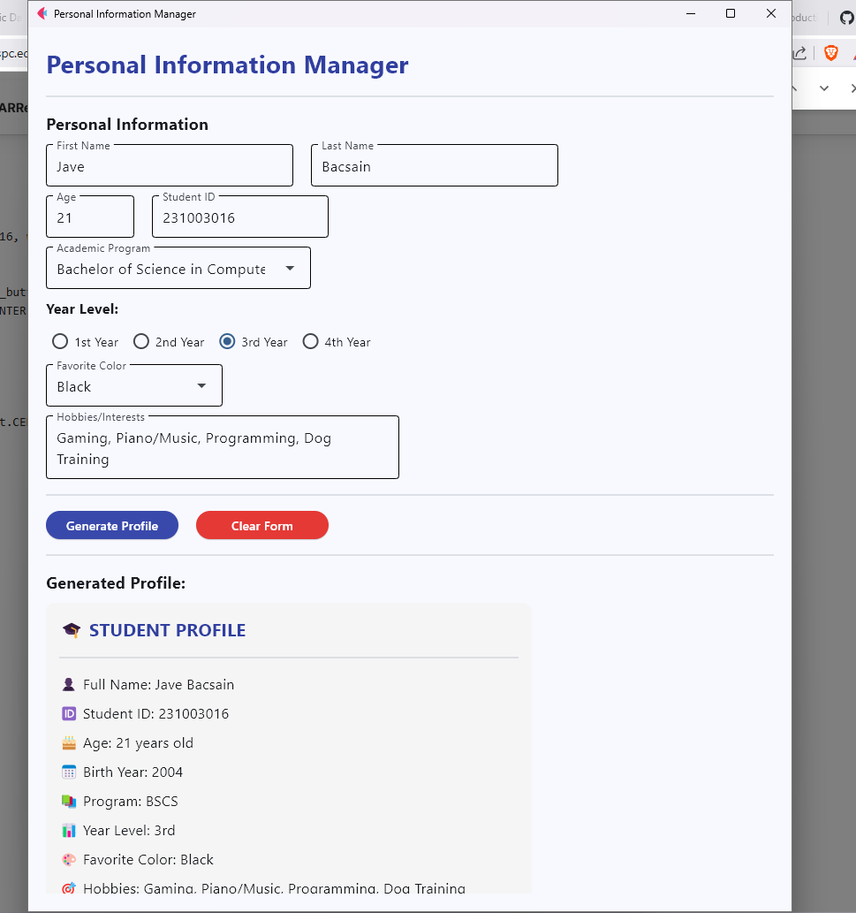
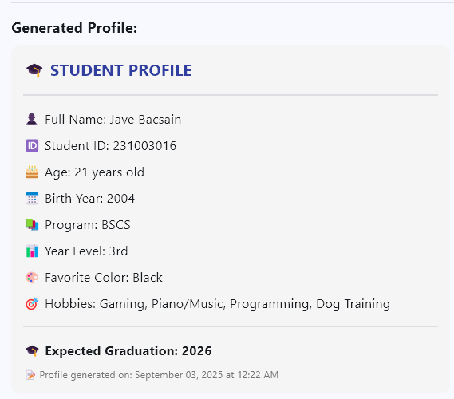
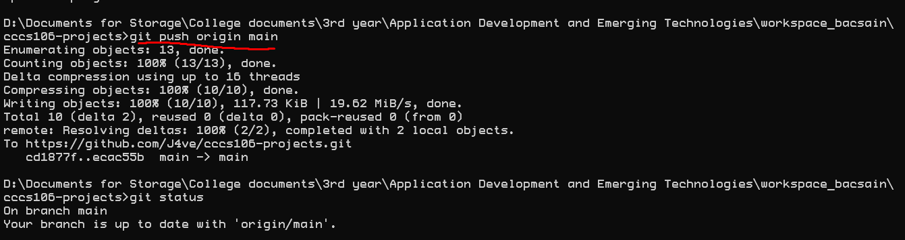

# Lab 2 Report: Git Version Control and Flet GUI Development

**Student Name:** Jave Atanacio Bacsain
**Student ID:** 231003016
**Section:** BSCS-3A
**Date:** September 3, 2025

## Git Configuration

### Repository Setup
- **GitHub Repository:** [J4ve/cccs106-projects](https://github.com/J4ve/cccs106-projects)
- **Local Repository:** ✅ Initialized and connected
- **Commit History:** 
    - **6f41ec8** (HEAD -> main, origin/main) — Edited `week2_labs/LAB2_REPORT.md` and added new screenshot to `lab2_screenshots`
    - **05d128d** — Update `README.md` with new application information
    - **8aa3414** — Add placeholder for enhanced calculator GUI
    - **ecac55b** — Add Week 2 labs: Flet GUI applications
    - **cd1877f** — Added batch file for activating virtual environment
    - **c88fd94** — Lab 1 report markdown fix
    - **a214252** — Lab 1 report markdown final edit
    - **785c058** — Addition and fix of screenshots
    - **01daa72** — Gitignore part 2?
    - **09660d1** — Removed venv from tracking in the commits
    - **eefe26c** — Last before delete
    - **c76325f** — Week 2 part 2
    - **daf48c8** — Delete `cccs106_env_bacsain` directory
    - **266b70d** — Gitignore fix part 2
    - **2dc4199** — Gitignore fix
    - **ec4ab6f** — 3rd
    - **a9bceac** — For Week 2 I guess
    - **f53dc67** — Added md, screenshots, workspace, and hello world (not yet final)
    - **08ccf19** — First

### Git Skills Demonstrated
- ✅ Repository initialization and configuration
- ✅ Adding, committing, and pushing changes
- ✅ Branch creation and merging
- ✅ Remote repository management

## Flet GUI Applications

### 1. hello_flet.py
- **Status:** ✅ Completed
- **Features:** Interactive greeting, student info display, dialog boxes
- **UI Components:** Text, TextField, Buttons, Dialog, Containers
- **Notes:** Only added my personal information, works as instructed

### 2. personal_info_gui.py
- **Status:** ✅ Completed
- **Features:** Form inputs, dropdowns, radio buttons, profile generation
- **UI Components:** TextField, Dropdown, RadioGroup, Containers, Scrolling
- **Error Handling:** Input validation and user feedback
- **Notes:** Should not use dark mode in Windows settings to avoid visibility inconsistency

## Technical Skills Developed

### Git Version Control
- Understanding of repository concepts
- Basic Git workflow (add, commit, push)
- Branch management and merging
- Remote repository collaboration

### Flet GUI Development
- Flet 0.28.3 syntax and components
- Page configuration and layout management
- Event handling and user interaction
- Modern UI design principles

## Challenges and Solutions

Encountered issues when copying and pasting commit messages, which required editing through Nano, and faced Git ignore problems where changes weren’t properly synced. Resolved the latter by deleting the local `.gitignore` file and replacing it with a new one.

## Learning Outcomes

Learned how to use Git for version control, including creating branches, committing changes, and resolving Git ignore issues. Gained experience with GUI development using Python and Flet, and practiced collaborative programming skills by managing project files, integrating commits, and maintaining a clean repository structure

## Screenshots

- **First Flet GUI:**  
  

- **Personal Info GUI:**  
  

- **Generated Profile from Personal Info GUI:**  
  

- **Successful Git Push:**  
  

### Git Repository
- [✅] GitHub repository with commit history
- [✅] Local git log showing commits

### GUI Applications
- [✅] hello_flet.py running with all features
- [✅] personal_info_gui.py with filled form and generated profile

## Future Enhancements

For `enhanced_calculator.py`, add more advanced operations and possibly include unit conversion features. For `hello_flet.py` and `personal_info_gui.py`, improve the GUI to adapt to Windows themes (dark/light mode) and implement additional design enhancements for a better user experience.